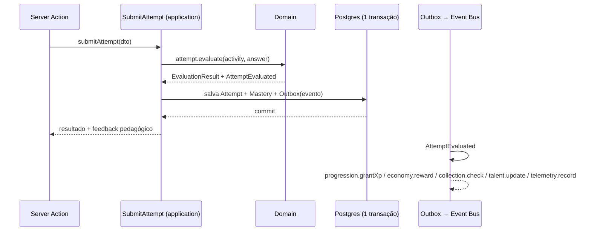
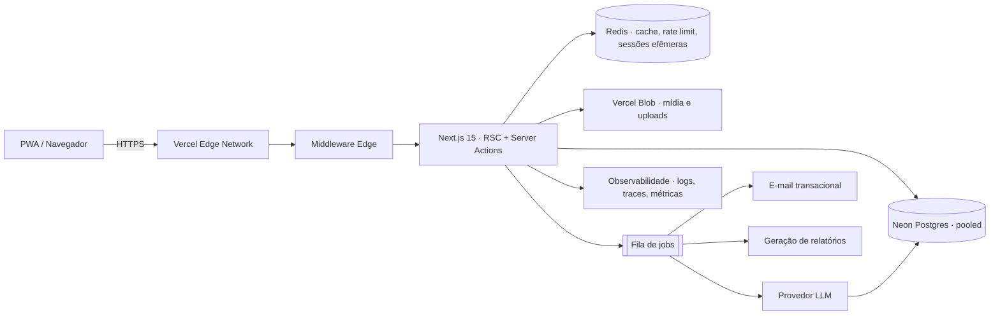

# 01 — Arquitetura do Sistema

## 1. Estilo arquitetural

**Monólito modular com Clean Architecture, orientado a eventos internamente.**

Por que não microsserviços: o produto é um sistema fortemente coeso (XP, conquistas, economia e
progresso mudam juntos numa mesma transação). Microsserviços aqui comprariam latência e
consistência eventual sem necessidade. O que fazemos é **isolar módulos com fronteiras reais**
(dependências verificadas por lint) para que qualquer módulo possa ser extraído depois sem
reescrever domínio — a extração vira troca de adaptador, não reescrita.

### Camadas

```
┌──────────────────────────────────────────────────────────────┐
│ PRESENTATION — RSC, Client Components, Server Actions, rotas │  Next.js
├──────────────────────────────────────────────────────────────┤
│ APPLICATION — Use Cases, Ports (interfaces), DTOs, Policies  │  TS puro
├──────────────────────────────────────────────────────────────┤
│ DOMAIN — Entities, Value Objects, Domain Services, Events    │  TS puro
├──────────────────────────────────────────────────────────────┤
│ INFRASTRUCTURE — Prisma, Redis, Blob, LLM, Email, Queue      │  Adapters
└──────────────────────────────────────────────────────────────┘
        ▲ dependências apontam sempre para o centro (DIP)
```

**Regras duras (verificadas em CI por `dependency-cruiser` + `eslint-plugin-boundaries`):**

| Camada | Pode importar | Nunca importa |
|---|---|---|
| `domain` | nada além de si mesma e de `shared/kernel` | prisma, next, react, zod-de-infra, fetch |
| `application` | `domain` | prisma, next, react |
| `infrastructure` | `application` (ports), `domain` | outra `presentation` |
| `presentation` | `application` (use cases), `shared/ui` | `infrastructure` diretamente (só via composition root) |

Violação de fronteira quebra o build. Isto é o que impede a erosão em 3 anos de evolução.

---

## 2. Bounded contexts (módulos)

| Módulo | Responsabilidade | Agregados principais |
|---|---|---|
| `identity` | Contas adultas, sessões, RBAC, organizações, consentimento | `Account`, `Session`, `Organization`, `Consent` |
| `learner` | Perfil da criança, preferências, acessibilidade, faixa etária | `Learner`, `LearnerSettings` |
| `curriculum` | Árvore de competências (BNCC e não-BNCC), pré-requisitos | `Subject`, `Strand`, `Skill`, `Objective` |
| `content` | Atividades, versionamento, pacotes de conteúdo, mídia | `Activity`, `ContentPack`, `Asset` |
| `quest` | Academias, mundos, mapas, capítulos, missões, chefões | `Academy`, `World`, `Chapter`, `Quest`, `Stage` |
| `assessment` | Tentativas, avaliação, domínio, revisão espaçada | `Attempt`, `SkillMastery`, `ReviewCard` |
| `progression` | XP, nível, energia, sequência (streak), desbloqueios | `LearnerProgress`, `Unlock` |
| `economy` | Moedas, cristais, diamantes, loja, inventário — com razão contábil | `Wallet`, `LedgerEntry`, `InventoryItem`, `ShopOffer` |
| `collection` | Conquistas, medalhas, mascote, casa, coleções, veículos | `Achievement`, `Companion`, `Home` |
| `tutor` | Tutor IA, sessões de tutoria, geração adaptativa, segurança | `TutorSession`, `TutorTurn`, `GenerationJob` |
| `talent` | Inferência de perfil de talentos e recomendação | `TalentProfile`, `Recommendation` |
| `guardian` | Painel dos pais, controles, metas, relatórios | `GuardianLink`, `ScreenTimeRule`, `Report` |
| `classroom` | Turmas, atribuições, correção, ranking saudável | `Classroom`, `Assignment`, `Submission` |
| `notification` | Preferências, envio (push/e-mail/in-app), agendamento | `NotificationPref`, `Notification` |
| `telemetry` | Eventos de aprendizagem, métricas, funis (pseudonimizados) | `LearningEvent` |
| `platform` | Auditoria, feature flags, configuração, i18n, jobs | `AuditLog`, `FeatureFlag` |

Comunicação entre módulos: **nunca** import direto de use case alheio. Só por (a) *domain events*
via barramento in-process com **outbox transacional**, ou (b) *ports* explicitamente declarados
(ex.: `quest` depende da porta `MasteryReader` implementada por `assessment`).

### Exemplo do fluxo por eventos (por que isso importa)



`progression`, `economy`, `collection`, `talent` e `telemetry` **não são chamados** pelo caso de uso
de tentativa. Eles reagem. Adicionar um novo efeito (ex.: "missão em família sugerida ao acertar 5
seguidas") é **um handler novo**, zero alteração no fluxo existente — Open/Closed na prática.

Efeitos que precisam ser atômicos com a tentativa (XP e moedas visíveis no mesmo instante) são
executados **in-process, na mesma transação**, via handlers síncronos registrados; efeitos lentos
(IA, relatório, push) são despachados pelo outbox para a fila. Ver `08 §11`.

---

## 3. O Motor de Atividades (peça central)

O maior risco de um produto assim é acoplar cada minigame ao sistema. Resolvemos com um **registro
de plugins tipado**. Cada tipo de atividade declara 4 coisas e nada mais:

```ts
// application/ports — assinatura conceitual
export interface ActivityPlugin<TConfig, TAnswer> {
  readonly type: ActivityType;                      // 'MULTIPLE_CHOICE' | 'GRID_PUZZLE' | ...
  readonly configSchema: ZodType<TConfig>;          // valida o conteúdo autorado
  readonly answerSchema: ZodType<TAnswer>;          // valida o que a criança envia
  evaluate(config: TConfig, answer: TAnswer, ctx: EvaluationContext): EvaluationResult; // PURO
  readonly renderer: ActivityRendererId;            // client component resolvido por lazy import
}
```

- `evaluate` é **função pura** → testável sem banco, executável no servidor (anticheat) e no cliente
  (feedback otimista offline) com o mesmo código.
- Conteúdo é dado (`Activity.config: Json`), validado na autoria e na leitura pelo `configSchema`.
  **Novo minigame = novo plugin + conteúdo. Zero migration, zero mudança no motor.**
- O renderer é carregado por `next/dynamic`, então um Sudoku pesado não entra no bundle de quem faz leitura.

Tipos previstos na Fase 1: `MULTIPLE_CHOICE`, `MULTI_SELECT`, `TRUE_FALSE`, `FILL_BLANK`,
`WORD_BUILD`, `DRAG_MATCH`, `ORDER_SEQUENCE`, `NUMBER_LINE`, `GRID_PUZZLE` (sudoku/labirinto/tangram),
`MEMORY_PAIRS`, `SPEED_TAP`, `STORY_BRANCH`.
Fases seguintes: `CHESS_PUZZLE`, `CODE_BLOCKS`, `DRAWING_CANVAS`, `AUDIO_RECORD`, `FREE_TEXT` (avaliado por IA),
`PHOTO_PROOF`, `SIMULATION`, `BUILD_3D`.

---

## 4. Currículo como dado, não como código

`curriculum` guarda a **árvore de competências** (com código BNCC quando aplicável) e o **grafo de
pré-requisitos** (DAG). `quest` guarda a **narrativa** (mundos, mapas, missões). `content` guarda as
**atividades**. As três se ligam assim:

```
Skill (EF04MA05) ──< Objective ──< Activity ──< StageActivity >── Stage >── Quest >── Chapter >── World >── Academy
```

Consequências:
- A mesma atividade serve a missão da campanha, à revisão espaçada, ao dever de casa da escola e ao
  desafio gerado pela IA — **sem duplicação** (DRY real, no nível de dados).
- Trocar a narrativa (skin de mundo, evento sazonal) não toca no currículo.
- Alinhamento BNCC vira consulta, não planilha: relatório de cobertura é `SELECT` sobre o DAG.

---

## 5. Renderização e execução (Next.js 15)

| Superfície | Estratégia | Motivo |
|---|---|---|
| Marketing / landing | Static + ISR | SEO, custo zero |
| Mapa do mundo, hub, coleções | RSC + `unstable_cache` com tag `content:v{n}` + dados do jogador em stream | Conteúdo é global e cacheável; progresso é por usuário |
| Sessão de missão (gameplay) | Client island com estado local; dados iniciais via RSC; envio por Server Action | 60 fps sem round-trip por interação |
| Painel dos pais / professor | RSC + Suspense por widget (streaming) | Relatórios lentos não seguram a tela |
| Tutor IA | Server Action inicia + streaming de tokens via `ReadableStream` | Resposta percebida imediata |
| Auth, webhooks, uploads | Route Handlers | Contratos HTTP explícitos |

**Runtime:** Node.js por padrão. Edge **apenas** no middleware (roteamento, headers, rate-limit
leve). Prisma não vai para o edge.

**Middleware** faz somente: resolução de sessão/cookie, guarda de rota por papel, injeção de nonce
CSP, i18n, rate-limit de borda. Nenhuma regra de negócio.

---

## 6. Composition root e injeção de dependência

Sem container mágico. Um módulo `src/composition/` monta as fábricas:

```ts
// composition/quest.ts (conceitual)
export const questContainer = () => {
  const repo = new PrismaQuestRepository(db);
  const mastery = new PrismaMasteryReader(db);
  return { startQuest: makeStartQuest({ repo, mastery, clock, bus }) };
};
```

Server Actions consomem o container; testes injetam fakes. Isso é DIP sem framework de DI (KISS).

---

## 7. Infraestrutura de execução



- **Neon**: branch de banco por ambiente (`main`, `preview/*` efêmero por PR, `dev`). Connection
  string *pooled* (PgBouncer) para serverless; string direta apenas para migrations.
- **Fila**: jobs duráveis para IA, relatórios, e-mail, recomputação de agregados. Consumidores são
  Route Handlers autenticados por assinatura HMAC.
- **Blob**: uploads sempre por URL assinada de curta duração; nada de upload direto ao servidor.

---

## 8. Estratégia de qualidade

| Nível | Ferramenta | Regra de aceite |
|---|---|---|
| Tipos | TypeScript `strict` + `noUncheckedIndexedAccess` | zero `any` (lint bloqueia), zero `@ts-ignore` sem ADR |
| Unidade | Vitest | 100% dos `evaluate` de plugins; ≥ 90% do domínio |
| Integração | Vitest + Postgres em container (Testcontainers) | todo use case com efeito em banco |
| Componentes | Testing Library | todo componente com estado/acessibilidade |
| E2E | Playwright | 12 jornadas críticas (`03 §6`) |
| A11y | axe em E2E + `eslint-plugin-jsx-a11y` | zero violação séria/crítica |
| Performance | Lighthouse CI em PR | LCP, CLS, TBT dentro do orçamento (`10 §5`) |
| Fronteiras | dependency-cruiser | zero violação de camada |
| Política de produto | testes de política | as proibições de `00 §P2` |

CI bloqueia merge em qualquer falha. Preview por PR com banco Neon efêmero e seed determinístico.
