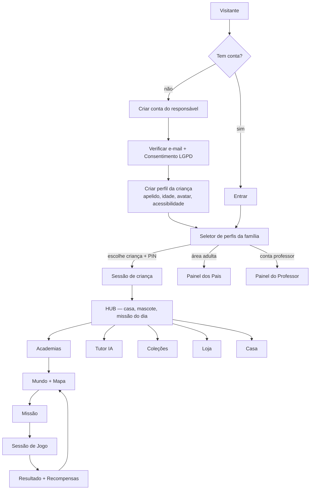
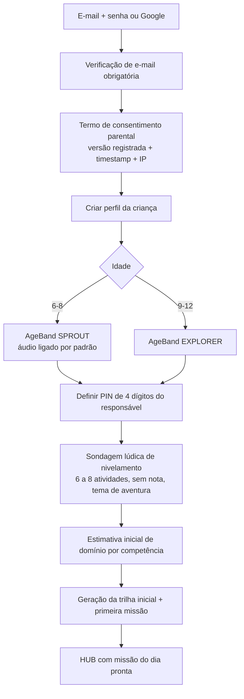
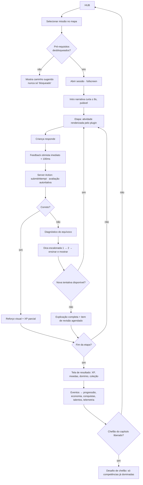
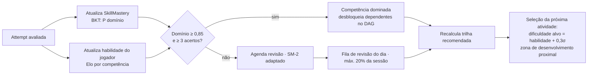
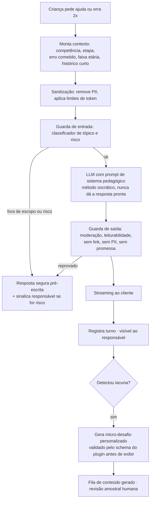
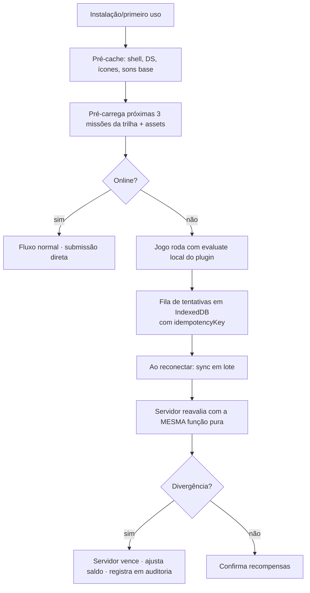
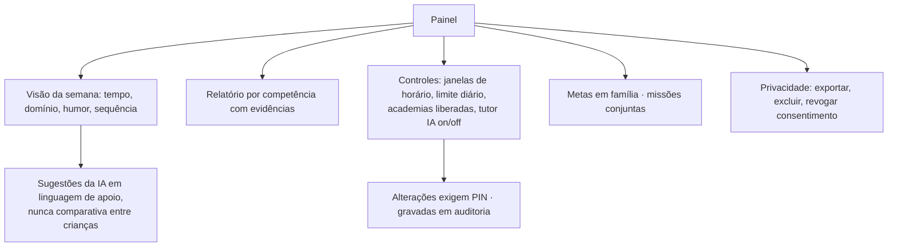

# 03 — Fluxogramas das Funcionalidades

## 1. Mapa de alto nível do produto

## 2. Onboarding do responsável e da criança

A sondagem **nunca** é apresentada como teste. É "a prova de entrada da Academia": narrativa,
sem pontuação exibida, adaptativa (para assim que a incerteza cai abaixo do limiar).

## 3. Loop principal de aprendizagem (o coração)

**Regra crítica (P4):** o caminho `L13 → L14` é obrigatório no tipo `EvaluationResult`. Não existe
ramo que devolva "errado" sem ensino.

## 4. Adaptatividade e revisão espaçada

Seleção de dificuldade mira **~80% de acerto** — faixa de fluxo (Csikszentmihalyi) e de motivação
sustentada. Abaixo de 60% por 3 atividades, o sistema recua e injeta reforço; acima de 95% por 5,
avança e reduz repetição.

## 5. Fluxo do Tutor IA (com segurança)

Conteúdo gerado por IA **só chega à criança se passar** pelo `configSchema` do plugin e pela
moderação. Geração inválida cai em fallback determinístico do banco curado.

## 6. Jornadas críticas cobertas por E2E

1. Criar conta → verificar e-mail → consentir → criar criança → entrar no hub.
2. Sondagem de nivelamento completa gera trilha.
3. Missão completa com 100% de acerto → recompensas creditadas exatamente uma vez.
4. Missão com erro → dica → acerto → item de revisão agendado.
5. Sessão interrompida (fechar aba) → retoma na mesma etapa, sem perder progresso.
6. Chefão bloqueado → caminho sugerido → chefão liberado após domínio.
7. Compra na loja → saldo debitado, item no inventário, razão contábil consistente.
8. Troca de perfil de criança exige PIN.
9. Responsável define limite de tempo → criança atinge limite → tela de pausa gentil.
10. Responsável exporta e exclui dados (LGPD).
11. Professor cria turma, atribui missão, vê conclusão.
12. Offline: entrar sem rede, jogar missão pré-carregada, sincronizar ao voltar.

## 7. Fluxo offline (PWA)

Recompensas offline são **provisórias e marcadas** na UI ("sincronizando"), evitando tanto frustração
quanto exploit.

## 8. Fluxo do responsável (controle e visão)

