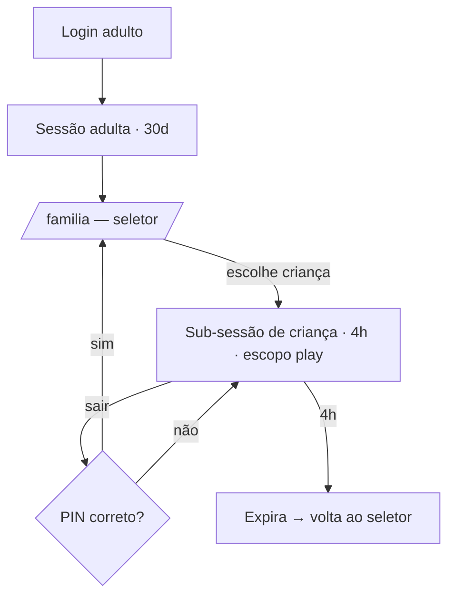

# 09 — Autenticação, Segurança e Privacidade

## 1. Princípio central

**Criança não tem conta.** Criança tem *perfil* dentro da conta de um adulto responsável (ou, no
contexto escolar, dentro de uma turma autorizada pela escola com consentimento do responsável).
Isso elimina de uma vez: e-mail infantil, senha esquecida de criança, recuperação por dados
pessoais, engenharia social sobre menor, e a maior parte da superfície de risco LGPD.

## 2. Identidades e como cada uma entra

| Identidade | Método | Sessão |
|---|---|---|
| Responsável | e-mail+senha (Argon2id) ou Google/Apple OAuth; verificação de e-mail obrigatória | banco, 30 dias, cookie `__Host-` `HttpOnly` `Secure` `SameSite=Lax` |
| Criança (família) | seleção de perfil dentro da sessão do responsável; **PIN do responsável exigido para sair** da área infantil | sub-sessão derivada, 4h, cookie próprio com escopo reduzido |
| Criança (escola) | código de turma + código-imagem/palavra pessoal (sem PII, sem senha digitada) | sessão de aluno, expira no fim do turno, vinculada à `Organization` |
| Professor | e-mail+senha ou SSO da escola; MFA opcional | banco, 12h |
| Admin de escola / plataforma | e-mail+senha + **TOTP obrigatório** | banco, 8h, reautenticação para ações sensíveis |

### Sub-sessão de criança (desenho)
A sessão adulta permanece válida; o cookie de criança carrega `{ sessionId, learnerId, exp }`
assinado, com escopo `play:*` apenas. Consequências:
- Nenhum token de criança consegue ler rota adulta (checado no middleware **e** em cada use case).
- Sair da área infantil exige PIN → uma criança não navega sozinha para o painel financeiro dos pais.
- Trocar de criança revoga a sub-sessão anterior.



## 3. RBAC e autorização

- Papéis: `GUARDIAN`, `TEACHER`, `SCHOOL_ADMIN`, `CONTENT_AUTHOR`, `MODERATOR`, `PLATFORM_ADMIN`,
  além do sujeito implícito `LEARNER`.
- Papel é sempre **escopado** (`organizationId` ou família). Não existe permissão global implícita.
- Autorização é verificada **no use case**, com uma `Policy` explícita — nunca só na UI, nunca só no
  middleware:

```ts
// application/policies
canViewLearnerReport(actor, learnerId):
  actor.isGuardianOf(learnerId)
  || (actor.isTeacherOf(classroom) && learner.enrolledIn(classroom) && consent(CLASSROOM_ENROLL))
  || actor.hasRole(PLATFORM_ADMIN)   // registrado em auditoria
```
- Toda leitura de dado de criança passa por um `LearnerAccessGuard` central. Consulta Prisma direta
  a dados de criança fora de repositório autorizado é violação de fronteira (lint).

## 4. Server Actions endurecidas

Todas as Server Actions passam por um único wrapper `createAction`, que aplica, em ordem:

1. Resolução de sessão e verificação de escopo.
2. Verificação de política (autorização).
3. Validação Zod da entrada (fail-closed; entrada não declarada é rejeitada).
4. Rate limit (por conta, por IP e por ação).
5. Idempotência quando a ação tem efeito econômico.
6. Execução do use case.
7. Auditoria + telemetria + tratamento de erro (nunca vaza *stack* ao cliente).

Nenhuma Server Action é escrita "solta". Ação sem wrapper é bloqueada por regra de lint própria.

## 5. Controles de segurança

| Ameaça | Controle |
|---|---|
| XSS | React por padrão; **zero `dangerouslySetInnerHTML`** (lint bloqueia; exceção só com sanitização por `DOMPurify` isolada em um único módulo revisado) + CSP estrita com nonce por requisição, sem `unsafe-inline`/`unsafe-eval` |
| CSRF | Server Actions do Next 15 (verificação de Origin) + cookies `SameSite=Lax` + token anti-CSRF em Route Handlers mutantes |
| SQL Injection | Prisma parametrizado; `$queryRaw` proibido por lint exceto em módulos de relatório revisados, sempre com `Prisma.sql` |
| Força bruta | rate limit por conta+IP com backoff exponencial; bloqueio temporário; captcha após 5 falhas |
| Enumeração de contas | respostas idênticas em login/recuperação; tempo de resposta constante |
| Sequestro de sessão | rotação de token no login, hash de token no banco, invalidação em troca de senha, lista de sessões ativas visível ao usuário |
| Upload malicioso | URL assinada, tipos permitidos, limite de tamanho, verificação de *magic bytes*, varredura antes de publicar, servido de domínio separado |
| Prompt injection (IA) | separação estrita de conteúdo do usuário/sistema, guarda de entrada e saída, sem ferramentas com efeito colateral no tutor, sem dados de outra criança no contexto |
| Abuso de custo de IA | orçamento por criança/dia, cache semântico, roteamento por modelo, alerta de anomalia |
| Cabeçalhos | HSTS (preload), `X-Content-Type-Options`, `Referrer-Policy: strict-origin-when-cross-origin`, `Permissions-Policy` restritiva, `X-Frame-Options: DENY` |
| Segredos | apenas em variáveis de ambiente validadas por Zod na inicialização; rotação documentada; nunca no cliente |
| Dependências | `npm audit` + Dependabot + verificação de licença no CI |

**Rate limits iniciais** (janela deslizante em Redis): login 5/min/IP · criação de conta 3/h/IP ·
submissão de tentativa 60/min/criança · tutor 20/h/criança · exportação de dados 3/dia/conta ·
uploads 20/h/conta.

## 6. LGPD (e compatibilidade com COPPA/GDPR-K)

| Exigência | Implementação |
|---|---|
| Base legal | consentimento parental explícito e específico, registrado com versão do texto, data e IP com hash (`Consent`) |
| Minimização | criança fornece **apelido e ano de nascimento**. Sem nome completo obrigatório, sem CPF, sem endereço, sem foto obrigatória |
| Finalidade | consentimentos separados: dados essenciais, tutor IA, analytics, upload de mídia. Recusar analytics ou IA **não** degrada o produto essencial |
| Transparência | página de privacidade em linguagem simples + versão ilustrada para a criança |
| Acesso e portabilidade | exportação em JSON+PDF, gerada por job, entregue por link assinado de 24h |
| Exclusão | exclusão real em até 30 dias: apaga PII, mantém eventos pseudonimizados sem reversibilidade; confirmação por e-mail e registro em auditoria |
| Retenção | telemetria bruta 18 meses; transcrições do tutor 12 meses (mínimo 30 dias); auditoria 5 anos; conta inativa 24 meses → aviso e anonimização |
| Segurança | criptografia em trânsito (TLS 1.3) e em repouso (Neon); campos sensíveis (PIN, tokens, MFA) com hash/cifra em coluna |
| Subprocessadores | listados publicamente (Vercel, Neon, provedor de LLM, e-mail); DPA assinado |
| Transferência internacional | cláusulas contratuais; dado de criança pseudonimizado antes de sair para o provedor de IA (**nunca** enviamos nome, e-mail ou id real) |
| Incidente | plano de resposta documentado, notificação à ANPD e aos responsáveis conforme prazo legal |
| Encarregado (DPO) | canal de contato publicado |

### O que **nunca** é coletado de criança
Geolocalização precisa, contatos, microfone/câmera sem ação explícita e consentimento por atividade,
biometria, identificadores de publicidade. **Sem publicidade e sem rastreamento de terceiros na área
infantil — nenhum script de terceiro roda em `(play)`.**

### O que criança nunca faz
Chat livre com outra pessoa, publicar texto/imagem visível a estranhos, ver perfil de criança de
outra família, receber push, informar dados de pagamento.

## 7. Observabilidade e resposta

- Logs estruturados com `traceId`, **sem PII** (redação automática por lista de campos).
- Trilha de auditoria imutável para: mudança de permissão, controle parental, ajuste de saldo,
  acesso administrativo a dado de criança, exportação/exclusão, publicação de conteúdo.
- Alertas: pico de erro 5xx, latência p95 de ação crítica, falha de fila, gasto de IA fora da curva,
  taxa de conteúdo de IA reprovado, tentativa de acesso negado repetida.
- Revisão de segurança obrigatória em PR que toque auth, políticas, pagamentos ou IA.
