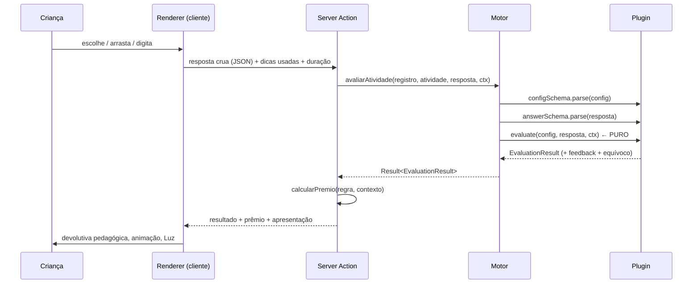

# 13 — Motor de Atividades

> O coração da plataforma. Ele **interpreta** atividades; ele não **contém** atividades.
>
> Contrato: [ADR 0002](adr/0002-motor-de-atividades-por-plugins.md) · [docs/01 §3](01-arquitetura.md)

---

## 1. A afirmação central

**O código nunca muda para criar conteúdo.** Adicionar uma missão é criar um arquivo JSON.
Adicionar um *tipo* de atividade é criar uma pasta e escrever duas linhas em dois manifestos.
O núcleo do motor não é tocado em nenhum dos dois casos.

Isso é verificado por três barreiras que quebram o build:

| Barreira | Onde | O que impede |
|---|---|---|
| `motor-e-puro` | `.dependency-cruiser.cjs` | o núcleo importar React, Next, Prisma ou `src/modules` |
| `plugins-nao-se-conhecem` | `.dependency-cruiser.cjs` | um plugin importar outro |
| `nucleo-nao-conhece-plugin` | `.dependency-cruiser.cjs` + `tests/policy/` | `registry.ts` citar um tipo concreto |

A prova viva: `ORDER_SEQUENCE` — resposta em lista, com crédito parcial, nada parecido com
múltipla escolha — entrou sem alterar uma vírgula de `contracts.ts` ou `registry.ts`.

---

## 2. Arquitetura

```
                    CONTEÚDO (dado, versionado em git)
                    content/**/missao-*.json
                              │
                              ▼
                    ┌──────────────────┐
                    │  content/loader  │  valida forma + referências
                    └────────┬─────────┘
                             │  MissaoNaSessao
                             ▼
    ┌────────────────────────────────────────────────────┐
    │  NÚCLEO DO MOTOR  (puro · isomórfico · sem I/O)     │
    │                                                    │
    │  contracts.ts    ActivityPlugin, EvaluationResult  │
    │  registry.ts     tipo → plugin, valida e executa   │
    │  difficulty.ts   Elo, fator de desafio, seleção    │
    │  rewards.ts      regra declarativa → prêmio        │
    │  presentation.ts animação, som, efeito             │
    │  session.ts      posição na missão, progresso      │
    │  telemetry.ts    o que se mede                     │
    └───────┬─────────────────────────────┬──────────────┘
            │                             │
            ▼                             ▼
    plugins/<tipo>/               renderers/<tipo>
    schema · evaluate             componente de tela
    (roda nos 2 lados)            (só cliente, sob demanda)
```

**Por que o núcleo é puro:** o mesmo `evaluate` roda no servidor (autoritativo, à prova de
trapaça) e no navegador (devolutiva instantânea, funciona offline). Se ele importasse Prisma ou
React, uma das duas pontas seria impossível — e a regra de correção passaria a existir em duas
versões, que divergem no primeiro ajuste.

---

## 3. Fluxo de execução



Ordem que não é negociável: **valida config → valida resposta → corrige**. Não existe caminho
que avalie sem validar; a única porta de entrada é `SealedPlugin.avaliar`.

---

## 4. Contrato do plugin

Um tipo de atividade declara **cinco coisas e nada mais**:

```ts
export interface ActivityPlugin<TConfig, TAnswer> {
  readonly type: ActivityType;
  readonly configSchema: ZodType<TConfig, ZodTypeDef, unknown>;  // valida conteúdo autorado
  readonly answerSchema: ZodType<TAnswer, ZodTypeDef, unknown>;  // valida resposta do cliente
  evaluate(config, answer, ctx): EvaluationResult;               // PURO
  probabilidadeDeChute(config): number;                          // para o BKT
  readonly rendererId: string;                                   // resolve a tela sob demanda
}
```

### `evaluate` é puro — o que isso proíbe

Sem `Date.now()`, sem `Math.random()`, sem `fetch`, sem banco. Duração e número da tentativa
chegam pelo `EvaluationContext`. Um `evaluate` impuro quebra três coisas de uma vez: o teste
determinístico, a execução offline no cliente e a auditoria de uma correção contestada.

### `EvaluationContext` não tem `learnerId`

Deliberado. Uma função de correção que conhece a criança é uma função que pode corrigir
diferente para crianças diferentes — injustiça que ninguém percebe até ser tarde. Só entra o que
legitimamente muda a correção: dicas usadas, número da tentativa, duração, locale.

### Erro sempre ensina — garantido pelo compilador

`EvaluationResult` é união discriminada. O ramo incorreto exige `feedback.ensino`:

```ts
| { outcome: "PARTIAL" | "INCORRECT" | "TIMEOUT"; feedback: FeedbackComEnsino; ... }
```

Um resultado incorreto sem ensino **não compila**. A regra de `docs/08 §12.3` deixa de depender
de revisão de código. E `tests/policy/motor-de-atividades.test.ts` percorre todo o acervo real
gerando respostas erradas, exigindo explicação em cada uma.

---

## 5. Estrutura dos arquivos de conteúdo

```
content/
├── schema/index.ts                     ← Zod de autoria (o "compilador" do conteúdo)
├── loader.ts                           ← varre, valida, monta o acervo
├── curriculo/
│   └── <disciplina>.json               ← competências → objetivos (BNCC quando aplicável)
└── academias/
    └── <academia>/
        ├── academia.json               ← nome, ilha, guardião, paleta
        └── <disciplina>/
            ├── disciplina.json         ← aponta para o currículo
            └── <FAIXA>/                ← SPROUT · EXPLORER · PIONEER · VANGUARD
                └── <nivel>/
                    ├── nivel.json
                    └── <modulo>/
                        ├── modulo.json
                        └── missao-*.json   ← missão, com fases e atividades
```

Cada missão contém **fases**, e cada fase contém **atividades**.

> **Nota sobre a hierarquia.** No pedido original a "Fase" aparecia acima da "Missão". No modelo
> de dados (`docs/04`), `Stage` é uma etapa *dentro* de `Quest`: a missão tem fases. Seguimos o
> modelo de dados para não criar duas verdades. Se a intenção era um agrupamento acima da missão,
> ele já existe e chama-se **Módulo**.

Não há índice central. Adicionar uma missão é criar o arquivo — o carregador a encontra pela
estrutura de pastas. Um índice seria mais um lugar para esquecer de atualizar.

---

## 6. Recompensa, dificuldade e apresentação são dados

Nenhum número de balanceamento mora no código.

```jsonc
"recompensa": {
  "porDesfecho": {
    "CORRECT":   { "xp": 10, "moedas": 5 },
    "PARTIAL":   { "xp": 6,  "moedas": 3 },
    "INCORRECT": { "xp": 4,  "moedas": 1 }   // nunca zero: errar e aprender rende
  },
  "multiplicadorPorDica":    [1, 0.6, 0.4],  // pedir ajuda reduz, não anula
  "decaimentoPorRepeticao":  [1, 0.3, 0.1, 0] // praticar é livre; farmar não compensa
}
```

O prêmio final é `base × fatorDica × fatorRepetição × fatorDesafio`, onde
`fatorDesafio = clamp(0.6, 1.8, 1 + (dificuldade − habilidade)/400)`.

**Regra ética embutida no cálculo** (`docs/08 §4`): sem Fôlego, moeda e cosmético não são
creditados — **XP e domínio continuam integrais**. A regra vive no cálculo, e não numa checagem
de UI que uma tela nova poderia esquecer.

Prêmios suportados: `xp`, `moedas`, `cristais`, `diamantes`, `folego`, `itens`, `conquistas`,
`desbloqueios`, `colecionaveis`. Os quatro últimos são ids opacos — o motor não sabe o que é um
veículo ou uma parte da cidade, apenas declara que foi concedido, e o módulo dono reage.

Dificuldade tem duas camadas: o **rótulo** de autoria (`FACIL`/`MEDIO`/`DIFICIL`/`ADAPTATIVO`) e a
**calibração** por telemetria (escala Elo). O rótulo dá o ponto de partida; a partir de ~200
tentativas a calibração assume e o sistema pode discordar do autor sem esperar alguém reeditar.

A seleção adaptativa é uma **porta** (`SeletorDeAtividades`). A implementação de hoje ordena por
proximidade do alvo (`habilidade + 60`, ≈80% de acerto esperado) e evita repetir o mesmo tipo três
vezes seguidas. Quando a IA assumir, troca-se a implementação no composition root e nenhum caso de
uso muda.

---

## 7. Como criar um novo tipo de atividade

Cinco arquivos, e **nenhuma alteração no núcleo**.

```
src/activities/plugins/<tipo-em-kebab>/
├── schema.ts          configSchema + answerSchema
├── evaluate.ts        função pura + probabilidadeDeChute
├── evaluate.test.ts   100% de cobertura (exigência de docs/01 §8)
└── index.ts           o objeto ActivityPlugin
src/activities/renderers/<tipo>-renderer.tsx
```

**Passo a passo**

1. **Escolha o `type`** entre os de `ACTIVITY_TYPES` (`contracts.ts`). Os 20 já estão declarados e
   espelham o enum do banco — não é preciso migration.
2. **Escreva `schema.ts`.** É aqui que a qualidade pedagógica é imposta: use `superRefine` para
   exigir o que o produto exige. Exemplo real — múltipla escolha recusa opção incorreta sem
   `ensino`.
3. **Escreva `evaluate.ts`.** Puro. Devolva `PARTIAL` quando houver crédito parcial honesto; use
   `equivoco` para diagnosticar o padrão de erro.
4. **Declare o plugin** em `index.ts`.
5. **Registre em dois manifestos:**
   - `src/activities/plugins/index.ts` → `selar(meuPlugin)`
   - `src/activities/renderers/index.tsx` → entrada no mapa `RENDERERS`
6. **Adicione o gabarito de erro** em `tests/policy/motor-de-atividades.test.ts`
   (`RESPOSTAS_ERRADAS`). O teste de política falha se você esquecer — de propósito.
7. `npm run verify`

---

## 8. Como criar uma nova missão

Um arquivo. Nenhuma alteração de código.

```bash
content/academias/<academia>/<disciplina>/<FAIXA>/<nivel>/<modulo>/missao-02-nome.json
```

```jsonc
{
  "slug": "missao-02-nome",
  "nome": "Nome que a criança lê",
  "tipo": "PRACTICE",              // STORY · PRACTICE · CHALLENGE · BOSS · REVIEW · PROJECT · FAMILY · DAILY
  "ordem": 2,
  "introducao": "Por que essa missão existe, na voz do guardião.",
  "conclusao": "O que mudou no mundo.",
  "fases": [
    {
      "slug": "fase-01",
      "nome": "Nome da fase",
      "atividades": [
        {
          "slug": "atividade-01",
          "tipo": "MULTIPLE_CHOICE",
          "objetivo": "contar-ate-10",     // precisa existir em content/curriculo/
          "dificuldade": "FACIL",
          "faixaMinima": "SPROUT",
          "faixaMaxima": "SPROUT",
          "config": { /* validado pelo configSchema do plugin */ },
          "recompensa": { /* opcional */ }
        }
      ]
    }
  ]
}
```

Depois: `npm run content:validate`. O validador confere forma, referências de objetivo, ids
duplicados, e entrega cada `config` ao plugin correspondente.

---

## 9. Como adicionar Academia, Disciplina, Nível, Módulo e Mundo

Todos são arquivos. Nenhum toca em código.

| O que | Onde | Arquivo |
|---|---|---|
| **Academia** | `content/academias/<slug>/` | `academia.json` — nome, ilha, guardião, paleta, ordem |
| **Disciplina** | `content/academias/<academia>/<slug>/` | `disciplina.json` — aponta para um currículo |
| **Currículo** | `content/curriculo/` | `<disciplina>.json` — competências e objetivos |
| **Faixa etária** | `content/academias/.../<FAIXA>/` | só a pasta: `SPROUT`, `EXPLORER`… |
| **Nível** | `content/academias/.../<FAIXA>/<slug>/` | `nivel.json` — ordem e nível mínimo |
| **Módulo** | `.../<nivel>/<slug>/` | `modulo.json` — nome, descrição, ordem |
| **Missão** | `.../<modulo>/` | `missao-*.json` |

**Mundo** (`World` no banco) é a camada de mapa do módulo `quest`: agrupa capítulos e guarda o
`mapLayout`. Na modelagem de conteúdo ele corresponde ao **Nível**, e o `mapLayout` entra quando o
mapa visual for construído — hoje o hub lista as missões diretamente.

Adicionar uma Academia nova exige também uma paleta em `src/design-system/tokens/color.ts` (as
sete atuais já estão lá) — é a única exceção em que conteúdo novo encosta em código, porque cor é
token de design, não dado de missão.

---

## 10. O que o motor mede

`RegistroDeTentativa` (`telemetry.ts`): tempo, tentativas, acertos, erros, dicas usadas, XP,
pontuação, equívoco diagnosticado, dificuldade e habilidade no momento.

**Não existe `learnerId` neste tipo.** Telemetria usa `pseudonymId`, sempre (`docs/09 §6`,
verificado em teste de política). Tornar o campo inexpressável é mais forte que revisar código:
se ele existisse, um dia alguém o preencheria.

---

## 11. O que ainda não existe

Honestidade sobre a fronteira desta etapa:

- **Persistência de tentativas.** O contrato (`RegistradorDeTentativas`) está pronto; a gravação em
  `Attempt`/`LearningEvent` pertence ao módulo `assessment`, que ainda não existe.
- **Importador de conteúdo para o banco.** Hoje o motor lê os arquivos direto. O destino é
  `content/` alimentar o Postgres, que serve o runtime — o `content-bridge.ts` é o único ponto que
  muda.
- **BKT e Elo.** As fórmulas estão especificadas (`docs/08 §2`) e `probabilidadeDeChute` já
  alimenta o modelo; o cálculo em si é do `assessment`.
- **18 dos 20 tipos.** Por decisão explícita: um motor sólido com dois plugins vale mais que dez
  plugins acoplados.
